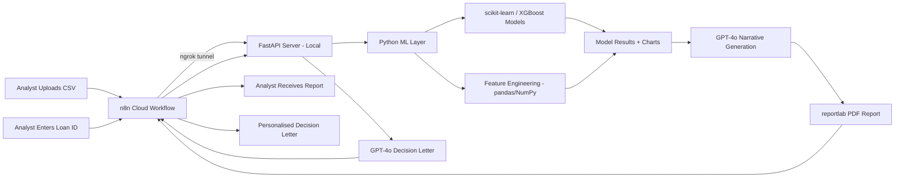

# AI-Powered Loan Approval Analysis System

**n8n Agentic Machine Learning Pipeline**


## Project Overview

This project is a fully automated, agentic machine learning pipeline built using **n8n Cloud, FastAPI, Python, and GPT-4o**. The system enables a bank analyst to upload a loan applicant dataset and receive a comprehensive AI-generated risk assessment report — with zero manual intervention beyond the initial upload.

- **Workflow 1 – Portfolio Analysis:** Upload a CSV of loan applicants and receive a full ML-powered portfolio risk report as a PDF.
- **Workflow 2 – Individual Loan Lookup:** Enter a Loan ID and receive a personalised AI-written decision letter explaining the approval or rejection.

## Business Problem

Traditional loan approval processes are manual, time-consuming, and inconsistent. Banks process thousands of applications requiring human review of financial profiles against lending criteria. This project demonstrates how an agentic AI pipeline can automate the full analytical cycle — from raw data ingestion to explainable, audit-ready decisions — reducing processing time from hours to minutes while maintaining transparency and compliance.

## System Architecture



*n8n Cloud orchestrates the pipeline end to end. Since n8n Cloud cannot access local machine resources directly, ngrok creates a secure public tunnel to the locally hosted FastAPI server, enabling communication between the cloud orchestrator and the on-premise ML execution environment.*

## Technologies Used

### Orchestration & Automation
The workflow orchestration layer is built on **n8n Cloud**, handling the full agentic pipeline — from form-based CSV ingestion through multi-step HTTP requests, OpenAI API calls, and final report delivery.

### Machine Learning
The analytical core is written in **Python**, using **scikit-learn** to train and evaluate three classification models — Random Forest, Decision Tree, and Gradient Boosting — alongside **XGBoost** as a fourth high-performance boosting alternative. Data ingestion, cleaning, and feature engineering are handled by **pandas** and **NumPy**, constructing four ratio-based engineered features from the raw applicant data. Model performance is visualised using **matplotlib** and **seaborn**, producing feature importance charts and model comparison bar charts embedded directly into the final PDF report.

### API & Report Generation
**FastAPI** serves as the REST API microservice layer, exposing five endpoints that bridge n8n's workflow nodes to the local Python environment, run using **uvicorn**. PDF generation is handled by **reportlab**, assembling structured report text and embedded chart images into a professionally formatted A4 document. **OpenAI's GPT-4o** is integrated at three points in the pipeline — generating a data understanding narrative, writing individual case explanations, and authoring personalised applicant decision letters — ensuring all outputs are human-readable, contextually accurate, and audit-ready.

## Key Results

| Metric | Value |
|---|---|
| Best Model | Decision Tree |
| ROC-AUC | 0.6073 |
| F1 Score | 0.2715 |
| Accuracy | 62.3% |
| Portfolio Approval Rate | 85.48% |
| Risk Distribution | 2,866 Medium · 783 Low · 620 High |

**Top Risk Factors:**
1. Loan-to-Income Ratio (0.2265)
2. Loan Term (0.1968)
3. Loan-to-Assets Ratio (0.0936)

> **Note:** CIBIL score was intentionally excluded from features to demonstrate model performance on financial ratios alone, improving explainability and fairness.

## Project Structure

```
Loan Approval - n8n/
├── loan_ml.py                # ML pipeline script
├── api.py                    # FastAPI server (5 endpoints)
├── loan_approval_dataset.csv # Input dataset
├── loan_results.json         # ML output (auto-generated)
├── loan_report.pdf           # Portfolio analysis report
├── feature_importance.png    # Chart (auto-generated)
├── model_comparison.png      # Chart (auto-generated)
└── Workflow ScreenShots/     # n8n workflow screenshots
```

## Portfolio Relevance

- End-to-end ML pipeline design and deployment (data → model → API → report)
- Agentic AI workflow orchestration using n8n with multi-step reasoning
- Explainable AI — feature importance, personalised decision reasoning, risk tiering
- REST API development with FastAPI for ML microservice architecture
- Real-world business framing — credit risk, compliance, audit-ready outputs
- GPT-4o integration for automated narrative generation and personalised communications

---

**Author:** [Dharshini Balakrishnan](https://github.com/Dharshiny5)

